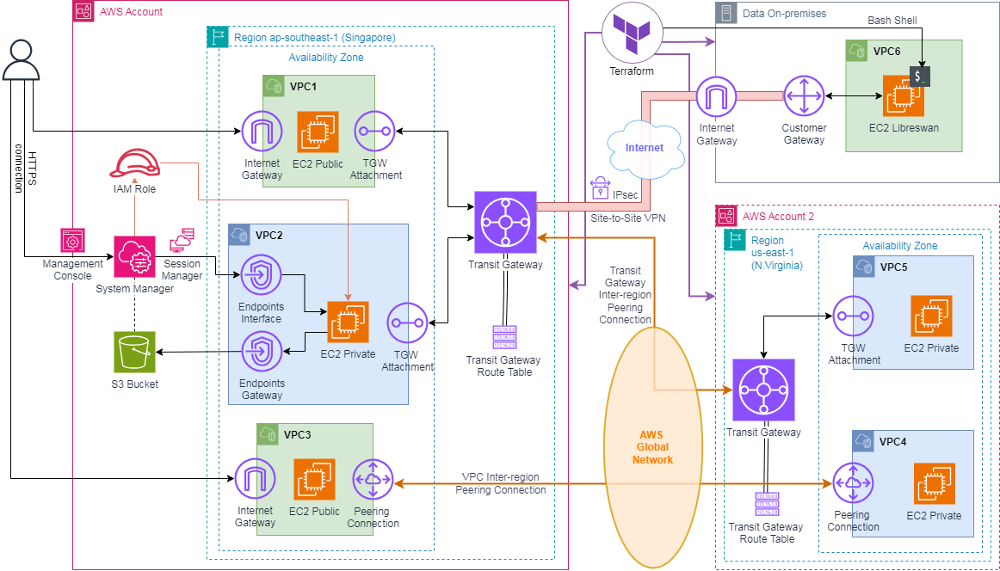

<h1 align="center" style="color: blue;">
    

        
    

    AWS - First Cloud Journey 
</h1>

### WorkShop 1 | AWS Site-to-Site VPN Connection

#### Overall
In this lab, we will make private connection from **Database server** to **Cloud server** through the internet enviroment, using Site-to-Site VPN on AWS service. And the server inside **Cloud server** can connect to Internet via NAT Gateway.

#### Hosted at [https://v2d27.github.io/aws-fcj/ws1](https://v2d27.github.io/aws-fcj/ws1) 

### WorkShop 2 | Automating AWS Network Connectivity with Terraform

#### Overall
This workshop focuses on creating a automated AWS network architecture using Terraform to enable secure and efficient connectivity across multiple AWS accounts and regions. This design uses AWS networking solutions, including VPN Site-to-Site connections, AWS Transit Gateway, VPC Peering, providing inter-region and multi-account connection. Creating secure connection with AWS Systems Manager (Session Manager) and saving the history of sessions to AWS S3.

#### Hosted at [https://v2d27.github.io/aws-fcj/ws2](https://v2d27.github.io/aws-fcj/ws2) 
#### Github Project [https://github.com/v2d27/aws-with-terraform](https://github.com/v2d27/aws-with-terraform) 

