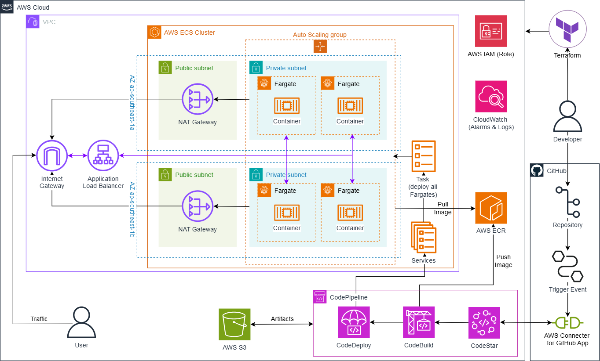

<h1 align="center" style="color: blue;">
    

        
    

</h1>

### WorkShop 1 | AWS Site-to-Site VPN Connection

#### Overall
In this lab, we will make private connection from **Database server** to **Cloud server** through the internet enviroment, using Site-to-Site VPN on AWS service. And the server inside **Cloud server** can connect to Internet via NAT Gateway.

#### Hosted at [https://v2d27.github.io/aws-fcj/ws1](https://v2d27.github.io/aws-fcj/ws1) 

---

### WorkShop 2 | Automating AWS Network Connectivity with Terraform

#### Overall
This workshop focuses on creating a automated AWS network architecture using Terraform to enable secure and efficient connectivity across multiple AWS accounts and regions. This design uses AWS networking solutions, including VPN Site-to-Site connections, AWS Transit Gateway, VPC Peering, providing inter-region and multi-account connection. Creating secure connection with AWS Systems Manager (Session Manager) and saving the history of sessions to AWS S3.

#### Hosted at [https://v2d27.github.io/aws-fcj/ws2](https://v2d27.github.io/aws-fcj/ws2) 
#### Github Project [https://github.com/v2d27/aws-with-terraform](https://github.com/v2d27/aws-with-terraform) 

---

### WorkShop 3 | Serverless Blue/Green ECS Deployment on AWS Fargate with Auto Scaling using Terraform

#### Overall

This workshop guides you through deploying containerized applications on AWS using Amazon Elastic Container Service (ECS) with Fargate, focusing on automated Blue/Green deployments and Auto Scaling for serverless application, all managed via Terraform:

- Use AWS ECS to efficiently deploy, manage, and scale containerized applications.
- Implement Blue/Green deployment strategies to minimize downtime and risk during application updates, leveraging AWS CodeDeploy and Application Load Balancer (ALB) for seamless traffic shifting and easy rollback.
- Set up a complete CI/CD pipeline using AWS CodeStar, CodePipeline, CodeBuild, and CodeDeploy to automate the build and deployment process from GitHub to ECS.
- Manage infrastructure as code with Terraform, enabling repeatable, scalable, and cost-effective AWS resource provisioning.
- Integrate supporting AWS services such as IAM, VPC, Auto Scaling, CloudWatch Logs, S3, and ECR for a robust, production-ready environment.

#### Hosted at [https://v2d27.github.io/aws-fcj/ws3](https://v2d27.github.io/aws-fcj/ws3) 

---

### WorkShop 4 | Pending